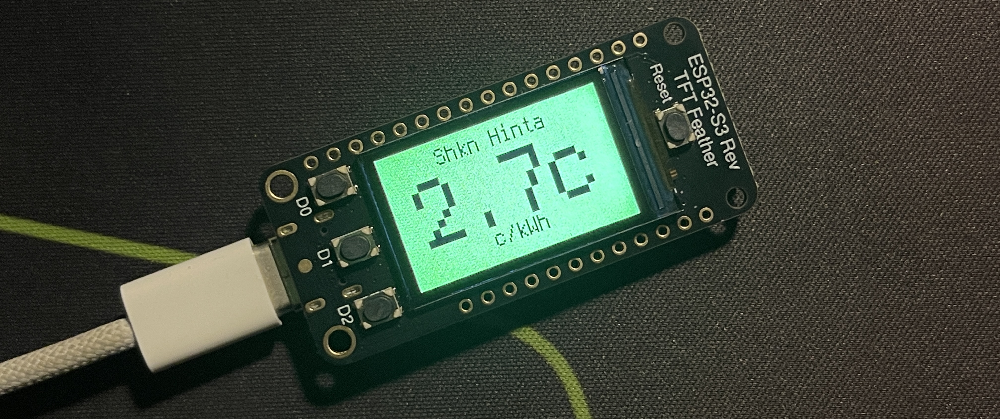
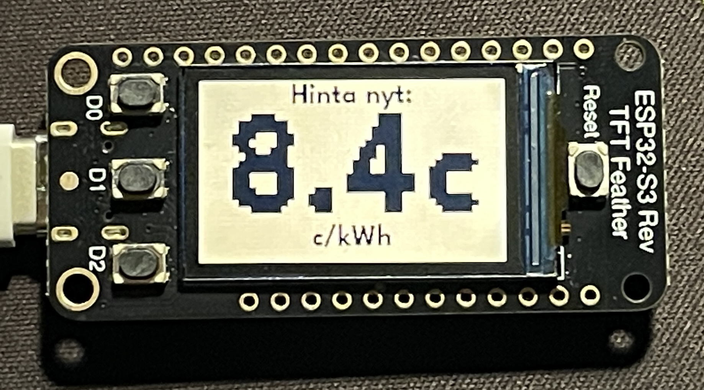
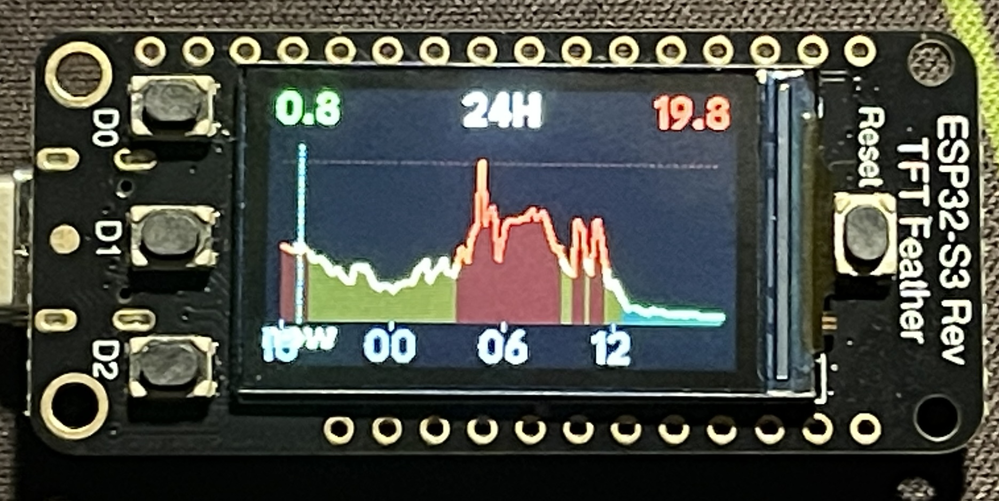
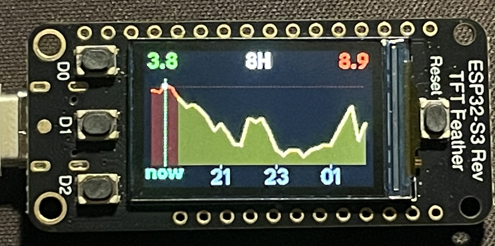
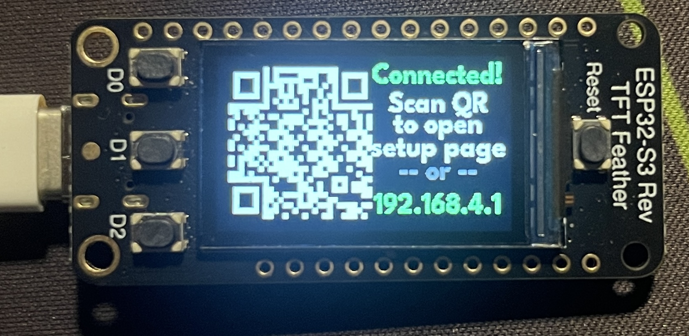

# SpotPrice Display

A real-time Finnish electricity spot price monitor built with CircuitPython for the Adafruit ESP32-S3 TFT Feather. Displays current electricity prices with color-coded backgrounds and 8-hour/24-hour forecast graphs.

  


(This image was taken before adding the new font)

## Quickstart

Get up and running in a couple of minutes.

1) Flash CircuitPython 9.x for the ESP32-S3 TFT Feather

> Download the `.uf2` file from https://circuitpython.org/board/adafruit_feather_esp32s3_tft/

> Double press the Reset button

> copy the `.uf2` file to FTHRS3BOOT

2) Connect the board via USB and run the installer from this project directory
```bash
chmod +x install.sh
./install.sh
```

3) Configure WiFi (first boot)
  > The device shows a QR code; scan it to join the temporary WiFi and open the setup page
  
> Select your home WiFi and enter the password; the device reboots and connects
  

  After this the device will reboot automatically and start working.

1) Use the device
- Press `D0` to cycle: Price → 8H Graph → 24H Graph
- Hold `D0` during boot to keep the USB drive writable for development

## Features

- **Real-time price display** with color-coded background (green = cheap, red = expensive)
- **8-hour and 24-hour forecast graphs** with smooth curves and 15-minute resolution
- **15-minute price resolution** - tracks Finnish Fingrid's quarter-hourly pricing
- **Smart caching** fetches 48 hours of prices just 3 times per day (00:01, 07:59, 15:59)
- **Power optimized** - WiFi disabled between fetches, adjustable display brightness
- **WiFi captive portal** for easy setup without editing config files
- **QR code setup** - scan to connect and configure
- **Automatic NTP sync** for accurate time-based pricing
- **Button controls** for switching views and entering setup mode
- **Graceful degradation** if optional libraries are missing

## Hardware

### Required

| Component | Description | Purchase Link |
|-----------|-------------|---------------|
| Adafruit ESP32-S3 TFT Feather | Main board with built-in 1.14" TFT display | [Adafruit](https://www.adafruit.com/product/5345) |
| USB-C Cable | For power and programming (Any USB-C cable capable of datatransfer will do) | [Adafruit](https://www.adafruit.com/product/4473) |

### Optional

| Component | Description | Purchase Link |
|-----------|-------------|---------------|
| LiPo Battery | 3.7V battery for portable use | [Adafruit](https://www.adafruit.com/product/328) |

## Photos

| Main Display | Forecast View | Setup Screen |
|--------------|---------------|--------------|
|  |  |   |

## Installation

### 1. Install CircuitPython

Download and install CircuitPython 9.x for the ESP32-S3 TFT Feather from:
https://circuitpython.org/board/adafruit_feather_esp32s3_tft/

### 2. Quick Install (Recommended)

Connect your device via USB and run:

```bash
./install.sh
```

This script will:
- Create a Python virtual environment
- Install `circup` (CircuitPython library manager)
- Copy all project files to your device
- Install required CircuitPython libraries automatically

### 3. Manual Installation (Alternative)

If you prefer to install manually:

**Install libraries with circup:**

```bash
python3 -m venv venv
source venv/bin/activate
pip install circup
circup install --auto
```

**Or manually copy these libraries** from the [Adafruit CircuitPython Bundle](https://circuitpython.org/libraries) to the `/lib` folder:

- `adafruit_requests.mpy`
- `adafruit_ntp.mpy`
- `adafruit_connection_manager.mpy`
- `adafruit_ticks.mpy`
- `adafruit_display_text/` (folder)
- `adafruit_miniqr.mpy`
- `adafruit_bitmap_font/` (folder)

**Copy project files** to your CIRCUITPY drive:

```
CIRCUITPY/
    boot.py
    code.py
    spotprice/        (folder)
    font.bdf          (optional, custom font)
    settings.toml     (created automatically during setup)
    lib/
        (libraries listed above)
```

### 4. Configure WiFi

There are two ways to configure WiFi credentials:

**Option A: Captive Portal (Recommended for first-time setup)**

1. Power on the device
2. If no WiFi is configured, the device automatically enters setup mode
3. The device creates a WiFi network named "SpotPrice-Setup"
4. Scan the QR code on screen or connect manually (password shown on display)
5. A setup page will open automatically in your browser (if not scan the new QR code on the screen)
6. Select your home WiFi network and enter the password
7. The device saves credentials and reboots to connect

**Option B: Edit settings.toml**

Edit `settings.toml` on the CIRCUITPY drive directly:

```toml
CIRCUITPY_WIFI_SSID = "YourNetworkName"
CIRCUITPY_WIFI_PASSWORD = "YourPassword"
```

This method is useful when:
- You have USB access to the device
- You want to pre-configure before deployment
- You need to change networks without the captive portal

You can also start from the provided example:

```bash
cp settings.toml.example settings.toml
```

## Usage

### Button Controls

| Button | Action |
|--------|--------|
| D0 | Cycle through views: Price → 8H Graph → 24H Graph |
| D0 (held during boot) | Enable USB drive for development |

### Display Modes

**Price View (Mode 1)**

Shows the current electricity price in cents per kWh. The background color indicates the price level:

| Color | Price Range |
|-------|-------------|
| Blue | Negative (you get paid!) |
| Green | Below 1 c/kWh |
| Light Green | 1-3 c/kWh |
| Yellow/Orange | 3-13 c/kWh (gradient) |
| Red | Above 13 c/kWh |

**8-Hour Forecast (Mode 2)**

Shows a smooth curve graph of the next 8 hours of prices using 15-minute data points (32 slots). Ideal for planning immediate electricity usage.

**24-Hour Forecast (Mode 3)**

Shows a smooth curve graph of the next 24 hours of prices (96 slots). Great for seeing the full day's pricing pattern.

Both graph views are color-coded:
- Green: Below 3 c/kWh
- Yellow: 3-8 c/kWh  
- Red: Above 8 c/kWh

The filled area under the curve uses darker shades of the same colors. A white marker shows the current price position.

## Configuration

Edit the constants in `spotprice/config.py` to customize behavior:

```python
# Fetch schedule (hours in UTC)
FETCH_HOURS = [0, 7, 15]  # Fetch at 00:01, 07:59, 15:59
RETRY_INTERVAL = 30       # Retry after 30 seconds on error
DISPLAY_REFRESH = 120     # Check for price changes every 2 minutes

# Power saving
DISPLAY_BRIGHTNESS = 0.5  # 0.0-1.0 (lower = less power, 0.3 recommended for battery)

# Forecast settings
GRAPH_SLOTS_8H = 32       # Number of 15-min slots for 8-hour view
GRAPH_SLOTS_24H = 96      # Number of 15-min slots for 24-hour view

# Price thresholds (cents/kWh)
PRICE_LOW = 1.0           # Below this = bright green
PRICE_MED = 3.0           # Below this = light green
PRICE_HIGH = 8.0          # Above this = yellow in graph
PRICE_MAX = 13.0          # Above this = red background
```

### Power Saving

The device implements several power-saving strategies for battery operation:

1. **WiFi disabled between fetches** - Radio is only enabled during API calls (a few seconds every 12 hours)
2. **Reduced display brightness** - Default 50%, lower for longer battery life
3. **Infrequent display refresh** - Checks every 2 minutes instead of continuously

For maximum battery life, set `DISPLAY_BRIGHTNESS = 0.3`.

## API

This project uses the [Porssisahko API](https://porssisahko.net/) for Finnish electricity spot prices. The API is free and does not require authentication.

**Endpoint:** `https://api.porssisahko.net/v2/latest-prices.json`

**Caching Strategy:**
- The API returns 48 hours of 15-minute price slots (~192 entries)
- The device fetches new data 3 times per day at 00:01, 07:59, and 15:59
- WiFi is disabled between fetches to save power
- Prices are cached in memory and used for display updates
- Display refreshes every 2 minutes to detect new 15-minute price slots

## Project Structure

```
esp32-s3/
    boot.py           # Filesystem config (hold D0 during boot for USB access)
    code.py           # Main application entry point
    settings.toml     # WiFi credentials (auto-generated)
    font.bdf          # Custom font (optional)
    spotprice/        # Application modules
        __init__.py   # Package exports
        config.py     # Configuration constants
        display.py    # Display rendering (price view, graph)
        prices.py     # Price data parsing
        wifi_portal.py # Captive portal for WiFi setup
    lib/              # CircuitPython libraries
    images/           # Documentation images
```

## Troubleshooting

### "Filesystem may be read-only" during setup

The `boot.py` file configures the filesystem to be writable by CircuitPython. Make sure you have copied `boot.py` to the device and rebooted.

### USB drive not writable

By default, the device filesystem is writable by CircuitPython code (for saving WiFi credentials), which means USB is read-only. To edit files from your computer:

**Option 1: Hold D0 during boot**
Hold the D0 button while pressing reset or plugging in. This keeps USB drive writable for development.

**Option 2: Via REPL**
1. Open a serial console
2. Press Ctrl+C to enter REPL
3. Run: `import os; os.rename("boot.py", "boot.py.bak")`
4. Reset the device --> USB drive will be writable

### WiFi connection fails

1. Verify your SSID and password are correct
2. Ensure your router is using 2.4GHz (ESP32 does not support 5GHz)
3. Try moving closer to your router
4. Delete credentials from `settings.toml` to re-enter setup mode

### Display shows "Time error"

NTP sync failed. Check your internet connection. The device will retry on the next fetch cycle.

### Prices not updating

The API may be temporarily unavailable. The device will retry every 5 minutes on error. Normal operation only fetches new data every 12 hours since the API returns 48 hours of prices.

## Development

### Serial Console

Connect via USB and open a serial terminal at 115200 baud to see debug output.

On macOS/Linux:
```bash
screen /dev/tty.usbmodem* 115200
```

### Development Mode

Hold D0 during boot to enable USB drive write access (development mode). In this mode, CircuitPython cannot save WiFi credentials, but you can edit all files from your computer.

## License

This project is licensed under **CC BY-NC 4.0** (Creative Commons Attribution-NonCommercial 4.0 International).

You are free to share and adapt this work for non-commercial purposes with attribution. Commercial use is prohibited.

See [LICENSE](LICENSE) file for details.

## Author

Sam Z.

## Acknowledgments

- [Adafruit](https://www.adafruit.com/) for CircuitPython and the ESP32-S3 TFT Feather
- [Porssisahko](https://porssisahko.net/) for the electricity price API
